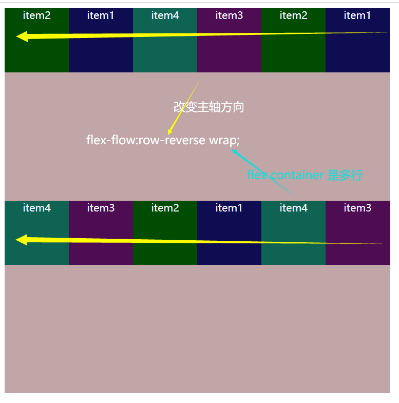
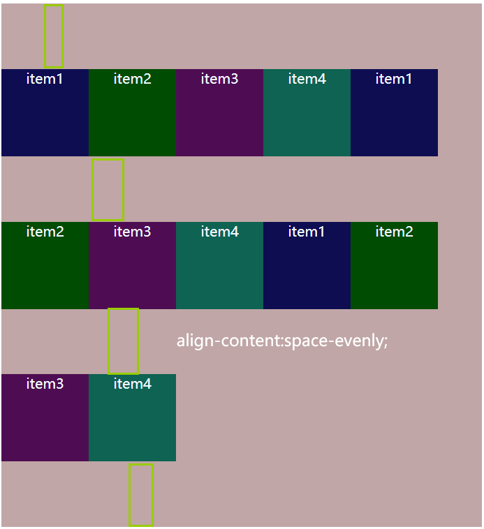

# flex
## flex布局/弹性布局
* 目前web开发中使用最多的布局方案
* 外面开启布局的元素叫flex container
    

* flex container里面的直接子元素叫做flex items
* 设置display属性为flex或者inline-flex可以成为flex container

    * `display:flex`->块级元素
    * `display:inline-flex`->行内元素

* flex items默认是沿着主轴（main axis）方向**从main start开始到main end结束排布**，不管里面的元素是块级元素还是行内元素，都是按照flex container要求来排列

    

## 应用在flex contianer上的CSS属性
### flex-flow
* 是 flex-direction||flex-wrap的简写

  

### flex-direction

* **决定主轴方向**，有四个取值

* 默认值是row（行），表示从左到右

* **display**:row-reverse，表示主轴方向相反从右到左

* column（列）:表示从上到下

* column-reverse表示从下到上

  

### flex-wrap
* 决定了flex container是单行还是多行

* nowrap(默认)：单行默认情况下，flex items都会在同一行显示，当盒子

  放不下的时候，它会按比例自动收缩

  

* wrap:多行

  

* wrap-reverse:多行

  

### justify-content（与主轴关系）
* **决定了flex-items在主轴上的对齐方式**

* **flex-start(**默认值)：与main start 对齐

  

* **flex-end**:与main end对齐

  

* **center**:居中对齐

  

* **space-between**:

  

  * flex items之间的距离相等
  * 与main start、main end两端对齐

* **space-evenly：**

  ​	

  * flex items之间的距离相等
  * flex items与main start ,main end之间的距离等于flex items之间的距离

*  **space-around:**

  

  * flex items之间的距离相等
  * flex items与main start,main end之间的距离是flex items之间距离的一半

### align-items（决定flex items在交叉轴上的对齐方式）
* 决定flex items在交叉轴上的对齐方式

* normal:在弹性布局中，效果与stretch一样

* stretch：当flex items在交叉轴方向上的size为auto时，flex item的高度会自动拉伸至flex container的高度。

  

* flex-start:与cross start （交叉轴）对齐

  

* flex-end:与cross end 对齐

  

* center:在交叉轴的中心点对齐

  

* baseline:与第一行文本的基准线对齐

  

### align-content（**多行**flex items与交叉轴关系）
* 决定了**多行**flex items在交叉轴上的对齐方式，用法与justify-content类似。

* stretch（默认）：当flex items在交叉轴方向上的size为auto时，flex item的高度会自动拉伸至flex container的高度。

  

* flex-start:与cross start对齐

  

* flex-end:与cross end对齐

  

* center：

  

* space-between:

  

  * flex items之间的距离相等
  * 与cross start、cross end两端对齐

* space-evenly:

  

  * flex items之间的距离相等
  * flex items与cross start ,cross end之间的距离等于flex items之间的距离

* space-around:

  

  * flex items之间的距离相等
  * flex items与cross start,cross end之间的距离是flex items之间距离的一半

## 应用在flex items上的CSS属性

### flex

* 是flex-grow,flex-shrink,flex-basis的简写，可以设置1~3个值
* 单值语法：
  * 一个无单位的数字   ---->    flex-grow的值
  * 一个有效的宽度值   ---->   flex-basis
  * 关键字none,auto,initial
* 双值语法：第一个值必须是一个无单位数字   ---->   flex grow
  * 第二个值必须是以下之一：
    * 一个无单位数字   ---->   flex shrink
    * 一个有效宽度值   ---->   flex-basis
* 三值语法：
  * 第一个值必须是一个无单位数字   ---->   flex grow
  * 第二个值必须是一个无单位数字   ---->   flex shrink
  * 第三个必须是一个效宽度值   ---->   flex-basis

###  flex-grow

* 决定了flex items如何扩展
  * 可以设置任意**非负数字**，默认值是0
  * 当**flex container在主轴方向上剩余有size时，flex grow属性才会生效**

* 如果**所有的flex items的flex-grow总和超过1**，每个flex item扩展的尺寸为:

  * flex container的**剩余size*对应那个flex-grow值/所有flex-grow值的总和**

  

* 如果**所有的flex items的flex-grow总和不超过1**，每个flex item扩展的尺寸为

  * flex container的**剩余size*对应那个flex-grow值**

* flex items扩展后得最终尺寸不能超过max-width\max-height

### flex-basis

* **用来设置flex items在主轴方向上的基本尺寸**
* auto:默认值，具体宽度数值随意设置
* 决定flex items最终base size的因素，从优先级高到低
    * max-width\maxheight\min-width\min-height
    * flex-basis
    * width\height
    * 内容本身的size
### flex-shrink
* 决定了flex items如何收缩
* 可以设置任意非负数字，默认值是1，
* 当flex items在主轴方向上超过了flex container的尺寸，flex shrink属性才会生效
* 如果所有的flex items的flex-shrink总和超过1，每个flex item收缩的尺寸为
    * flex items**超出flex container的size*收缩比例/所有flex-shrink值的总和**
* 如果所有的flex items的flex-shrink总和sum不超过1，每个flex item收缩的尺寸为
    * flex items超出 flex container的size*flex-shrink总和sum*收缩比例/所有flex items的收缩比例之和 
* flex items扩展后得最终尺寸不能超过max-width\max-height

### order
* 决定flex items的排布顺序
    * 可以任意设置整数（正整数，负整数），值越小越排在前面
    * 默认值是0
    * 注意：order:数字是写在flex items的样式中

### align-self

* auto（默认值）:遵从flex container的align-items设置
* 对齐方式   ---->   写了**align-self的flex items会覆盖align-items的对齐方式**
* 它的值与align-items对应的值一样

